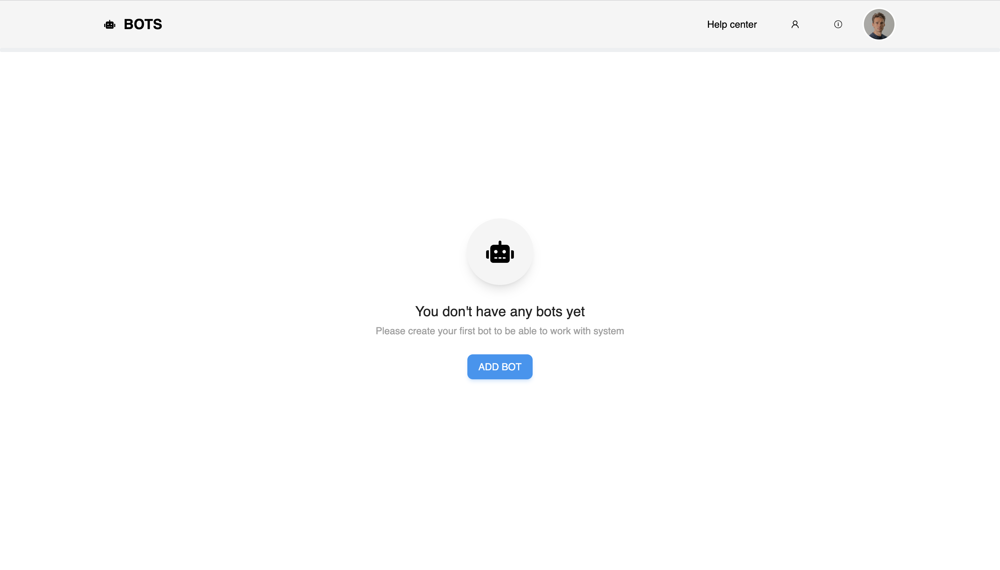
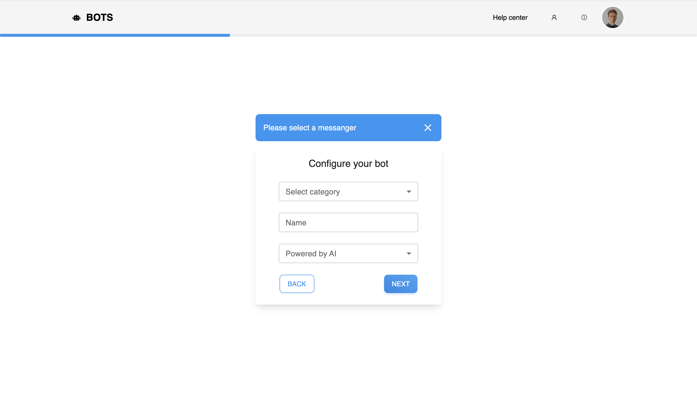
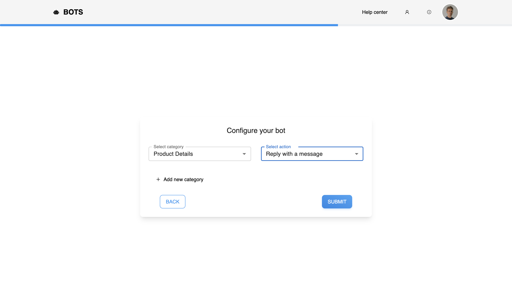
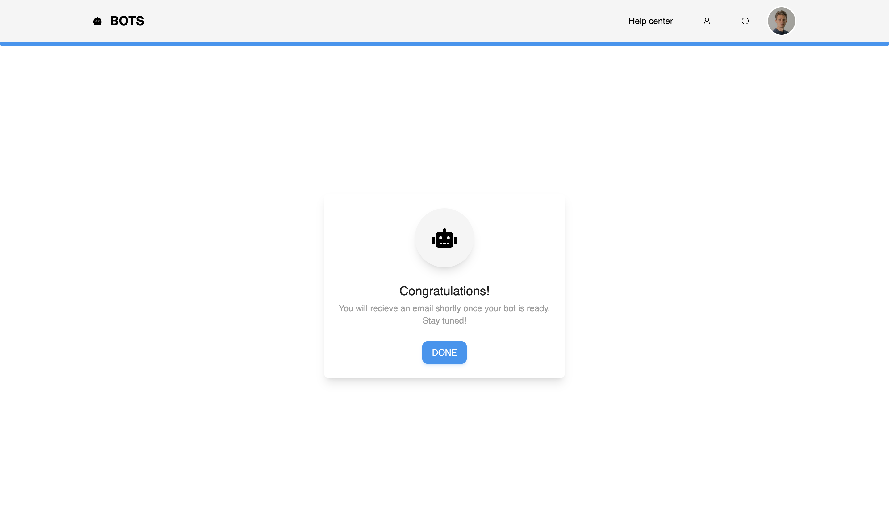

# Bots
  ## License: MIT
  ### 
  ## Table of Contents
  - [Description](#description)
  - [Usage](#usage)
  - [Screenshots of Application](#screenshots-of-application)
  - [Github Links](#github-links)
  - [Contributors](#contributors)

  ## Description:
  An app that creates a bot and configure bots automated replies for the following categories: Refund, Product Details, Customer Support.

  ## Usage:
  To start using our app run npm start. 

  ## Screenshots of Application

  Home page.

  

  Configure page.

  

  Category page.

  

  Done page.

  

  ## GitHub Links
  - GitHub: https://github.com/Havrushchenko/bots

  ## Contributors:
  - GitHub: https://github.com/Havrushchenko

  This README.md is made with a [Proffesional Readme Generator](https://github.com/Havrushchenko/proffesional-readme-generator).
